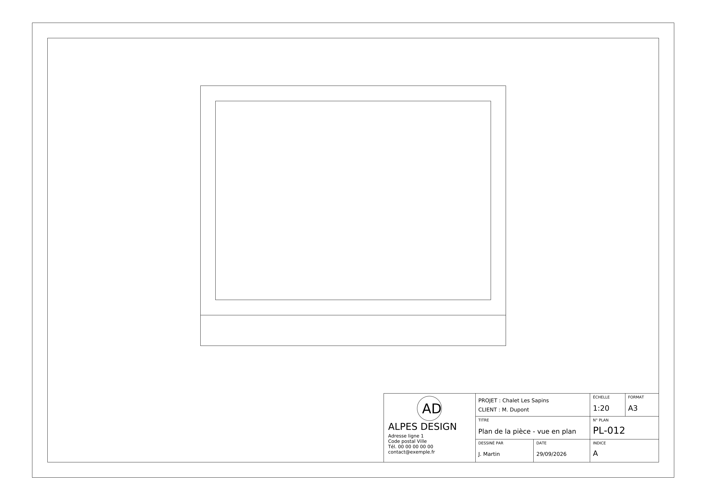

# ALPES-DESIGN — Assistant de dessin AutoCAD

Décrivez un dessin en français dans une fenêtre de dialogue : l'assistant (Claude)
le trace directement dans AutoCAD.

> « Dessine une pièce de 4 m sur 3 m avec des murs de 20 cm, et cote-la »
> « Ajoute une porte de 90 cm au milieu du mur du bas »
> « Supprime le cercle que tu viens de faire »

## Comment ça marche

```
Vous (fenêtre de dialogue) ──► Claude ──► outils de dessin ──► AutoCAD (en direct)
                                                           └─► ou fichier .dxf
```

1. Vous écrivez votre demande dans la fenêtre.
2. Claude la traduit en actions : calques, lignes, polylignes, rectangles, cercles,
   arcs, textes, cotes, suppression, zoom, enregistrement.
3. Les actions sont exécutées dans le document AutoCAD ouvert (via l'interface COM
   de Windows). Si AutoCAD n'est pas disponible, elles sont écrites dans un fichier
   DXF que vous ouvrirez ensuite dans AutoCAD.
4. La conversation garde le contexte : vous pouvez corriger, compléter, déplacer…

## Installation (Windows, avec AutoCAD)

1. Installez [Python 3.10+](https://www.python.org/downloads/) (cochez « Add to PATH »).
2. Dans un terminal, depuis ce dossier :
   ```bat
   pip install -r requirements.txt
   ```
3. Créez une clé API sur <https://console.anthropic.com> puis déclarez-la :
   ```bat
   setx ANTHROPIC_API_KEY "sk-ant-..."
   ```
   (fermez et rouvrez le terminal ensuite).

## Utilisation

Ouvrez AutoCAD avec un dessin, puis :

```bat
python -m autocad_assistant
```

La fenêtre de dialogue s'ouvre au-dessus d'AutoCAD. **Entrée** envoie le message,
**Maj+Entrée** passe à la ligne.

Options :

| Option | Effet |
|---|---|
| `--mode autocad` | Exige AutoCAD (erreur s'il n'est pas ouvert) |
| `--mode dxf --dxf plan.dxf` | Dessine dans un fichier DXF (sans AutoCAD, aussi sur Mac/Linux) |
| `--console` | Dialogue dans le terminal au lieu de la fenêtre |
| `--entreprise <fichier>` | Coordonnées pour le cartouche (par défaut `entreprise.json`) |
| `--profils <dossier>` | Bibliothèque de profils (voir ci-dessous) |
| `--model <id>` | Autre modèle Claude (par défaut `claude-opus-5-5`) |

Par défaut (`--mode auto`), AutoCAD est utilisé s'il est accessible, sinon le fichier
`dessin.dxf`, enregistré après chaque demande.

## Bibliothèque de profils (Forster, etc.)

L'assistant peut chercher et insérer vos profils au lieu de les redessiner.

**1. Rangez les profils dans un dossier**, un fichier DWG (ou DXF) par profil.
Les sous-dossiers servent de série ; le nom du fichier est la référence :

```
C:\Profils\
  catalogue.csv              ← facultatif, mais recommandé
  Forster Unico\
    U1002.dwg
    U1003.dwg
  Forster Fuego Light\
    F2001.dwg
```

**2. (Facultatif) Ajoutez un `catalogue.csv`** à la racine, exporté depuis Excel
(séparateur `;` accepté). Seule la colonne `Reference` est obligatoire ; toutes
les autres colonnes (description, poids, inertie, usage…) sont transmises à
l'assistant pour qu'il choisisse le bon profil :

```
Reference;Description;Poids kg/m
U1002;Dormant ouvrant intérieur;2,1
F2001;Profilé coupe-feu EI30;3,4
```

**Vérifiez le dossier** (nombre de profils par série, références en double) et
générez le modèle de catalogue à compléter dans Excel :

```bat
python -m autocad_assistant.profiles "C:\Profils"
```

S'il n'y a pas encore de catalogue, la commande crée `catalogue.csv` avec la liste de
vos références. Remplissez ensuite la colonne `Description` dans Excel. Si le
catalogue existe déjà, elle écrit les profils manquants dans `catalogue_a_completer.csv`.

**3. Lancez l'assistant en indiquant le dossier :**

```bat
python -m autocad_assistant --profils "C:\Profils"
```

ou une fois pour toutes : `setx ALPES_PROFILS "C:\Profils"`.

Vous pouvez alors demander : « Insère un dormant Forster Unico à l'origine et un
ouvrant à côté », « Quels profils coupe-feu EI30 as-tu ? », « Coupe verticale d'un
châssis de 1200 mm avec le profil U1002 en haut et en bas »…

Les profils sont insérés comme **blocs**, avec rotation, symétrie et échelle
possibles. Le point placé à l'endroit demandé est au choix : le point de base du
DWG, un coin (bas gauche, haut droite…) ou le centre du profil. C'est utile quand le
fichier du fabricant a son point de base loin du dessin. L'assistant reçoit leur encombrement réel
pour aligner et coter la suite.

Formats : en mode AutoCAD, les profils doivent être en `.dwg`. En mode fichier DXF,
les `.dxf` sont lus directement ; les `.dwg` nécessitent l'outil gratuit
[ODA File Converter](https://www.opendesign.com/guestfiles/oda_file_converter).

> Les fichiers de la bibliothèque restent sur votre ordinateur : inutile (et
> déconseillé, pour des questions de droits) de les ajouter à ce dépôt.

## Cartouche de l'entreprise

Demandez simplement : « Ajoute le cartouche en A3, plan n° 12, client Dupont ».
L'assistant dessine alors :

- **le cadre de la feuille** (A4 à A0, paysage ou portrait), centré sur le dessin ;
- **l'échelle choisie automatiquement** (1:1, 1:2, 1:5, 1:10, 1:20, 1:25, 1:50…), la
  plus grande à laquelle le dessin tient dans la feuille (ou celle que vous imposez) ;
- **le cartouche** en bas à droite avec le logo, le nom et les coordonnées de
  l'entreprise, puis le projet, le client, le titre, le dessinateur, la date,
  l'échelle, le format, le n° de plan et l'indice.



Le cadre est dessiné dans l'espace objet, à l'échelle, sur le calque `CARTOUCHE` :
imprimez-le « fenêtre » sur le cadre extérieur, à l'échelle indiquée. Redemander un
cartouche remplace l'ancien.

**Coordonnées de l'entreprise** : modifiez le fichier `entreprise.json` :

```json
{
  "nom": "ALPES DESIGN",
  "adresse": ["12 rue des Alpes", "74000 Annecy"],
  "telephone": "Tél. 04 00 00 00 00",
  "email": "contact@alpes-design.fr",
  "site": "www.alpes-design.fr",
  "logo": "logo.dwg",
  "dessinateur": "J. Martin",
  "format_par_defaut": "A3"
}
```

`logo` est un fichier DWG (ou DXF) placé à côté de `entreprise.json`. Il est mis à
l'échelle automatiquement dans le cartouche. Laissez-le vide s'il n'y a pas de logo.
Pour utiliser un autre fichier : `--entreprise chemin\entreprise.json` ou la variable
`ALPES_ENTREPRISE`.

## Conventions

- Unités : millimètres (dites « en mètres » ou « en cm » si besoin, l'assistant convertit).
- Repère : X vers la droite, Y vers le haut, angles en degrés.
- Couleurs de calque : numéros AutoCAD (1 rouge, 2 jaune, 3 vert, 4 cyan, 5 bleu…).

## Structure du code

| Fichier | Rôle |
|---|---|
| `autocad_assistant/backends.py` | Moteurs de dessin : AutoCAD (COM) et DXF (ezdxf) |
| `autocad_assistant/tools.py` | Outils proposés à Claude et leur exécution |
| `autocad_assistant/profiles.py` | Bibliothèque de profils : lecture du dossier, catalogue, recherche |
| `autocad_assistant/titleblock.py` | Cadre et cartouche automatiques |
| `autocad_assistant/agent.py` | Boucle de conversation avec Claude |
| `autocad_assistant/gui.py` | Fenêtre de dialogue (tkinter) |
| `autocad_assistant/__main__.py` | Point d'entrée et options |

**Ajouter un outil** (ex. hachures, blocs) : ajoutez la méthode dans les deux moteurs
de `backends.py`, déclarez l'outil dans `TOOLS` et son exécution dans `_handlers`
(`tools.py`).

## Tests

```bash
pip install pytest
python -m pytest
```

Les tests simulent Claude et vérifient le fichier DXF produit ; ils ne consomment
pas de crédits API.
